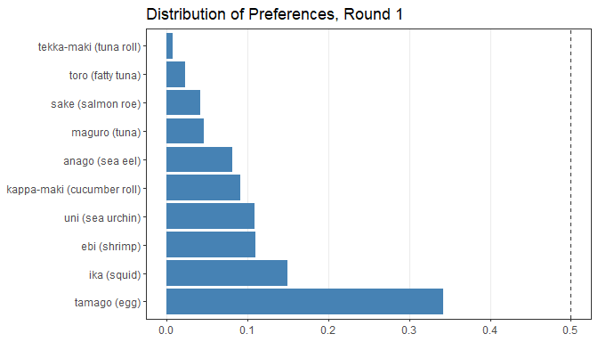
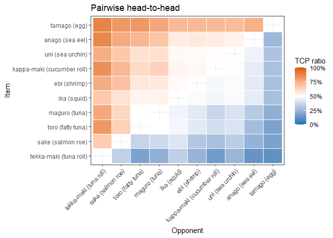
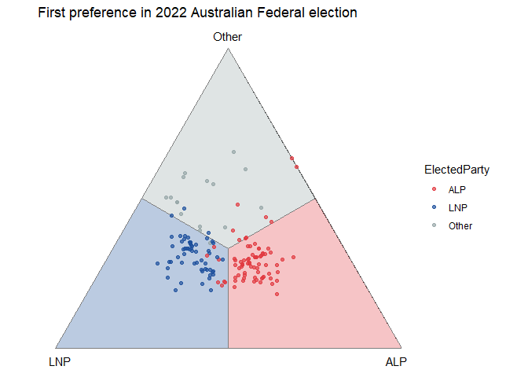
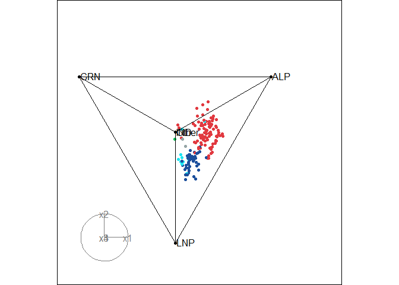
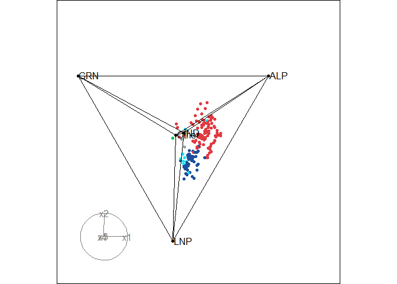

<!-- README.md is generated from README.Rmd. Please edit that file -->

# prefviz 

`prefviz` is a visualisation toolkit for preferential data, where
individuals rank or order a set of alternatives, such as ranked-choice
election ballots, tournament results, or survey rankings. The package
makes it easy to explore both single-contest and multi-contest
preference patterns through three complementary plot types:

- **Distribution of preferences bar chart** shows the marginal vote
  shares for each candidate in a single contest.
- **Pairwise heatmap** reveals head-to-head competition between every
  pair of candidates, including Condorcet winner/loser detection.
- **Ternary plot** compares multiple sets of preferences simultaneously
  by placing each one as a point inside a simplex, where each vertex
  represents one items and a point’s position reflects how support is
  split among all items. Traditional ternary plots support three items
  via a 2D simplex - an equilateral triangle, but `prefviz` extends this
  to high dimensions via animated tours when there are more than 3
  items.

# Installation

`prefviz` is available on CRAN:

``` r
install.packages("prefviz")
```

The development version of `prefviz` can be installed via:

``` r
# install.packages("devtools")
remotes::install_github("numbats/prefviz")
```

# Getting started

## Distribution of preferences bar chart

Used when you want to understand how preferences is spread across items
in a single contest.

``` r
sushi_data <- prefio::read_preflib(
  "00014 - sushi/00014-00000001.soc",
  from_preflib = TRUE
)

irv_result <- dop_irv(sushi_data,
                      preferences_col = preferences,
                      frequency_col   = frequency)

dop_bar(irv_result, items = -c(round, winner), at_round = 1)
```



## Pairwise heatmap

Used when you want to examine head-to-head competition between every
pair of candidates and identify Condorcet winners or losers.

``` r
pw <- pairwise_calculator(sushi_data,
                          preferences_col = preferences,
                          frequency_col   = frequency)
pw
#> Pairwise analysis (10 items)
#> 
#> Head-to-head results (first 5 rows):
#>        item_a            item_b wins_a wins_b total tcp_a tcp_b
#>  ebi (shrimp)   anago (sea eel)   2152   2848  5000 43.0% 57.0%
#>  ebi (shrimp)     maguro (tuna)   2848   2152  5000 57.0% 43.0%
#>  ebi (shrimp)       ika (squid)   2570   2430  5000 51.4% 48.6%
#>  ebi (shrimp)  uni (sea urchin)   2428   2572  5000 48.6% 51.4%
#>  ebi (shrimp) sake (salmon roe)   3449   1551  5000 69.0% 31.0%
#>        h2h_winner
#>   anago (sea eel)
#>      ebi (shrimp)
#>      ebi (shrimp)
#>  uni (sea urchin)
#>      ebi (shrimp)
#> 
#> Condorcet winner: tamago (egg)
#> Condorcet loser:  tekka-maki (tuna roll)

pairwise_heatmap(pw, value = "tcp")
```



## Ternary plot

Used when you want to compare preference distributions across many sets
of preferences simultaneously. Each point is one set of preference
(e.g. an electoral division, a customer survey, etc.), and its position
inside the simplex reflects how support is split among the items.

``` r
# First-preference shares across 2025 Australian Federal Election divisions
tern22_df <- aecdop22_transformed |>
  filter(CountNumber == 0)
head(tern22_df)
#> # A tibble: 6 × 6
#>   DivisionNm CountNumber ElectedParty   ALP   LNP Other
#>   <chr>            <dbl> <chr>        <dbl> <dbl> <dbl>
#> 1 Adelaide             0 ALP          0.400 0.32  0.280
#> 2 Aston                0 LNP          0.325 0.430 0.244
#> 3 Ballarat             0 ALP          0.447 0.271 0.282
#> 4 Banks                0 LNP          0.353 0.452 0.195
#> 5 Barker               0 LNP          0.209 0.556 0.235
#> 6 Barton               0 ALP          0.504 0.262 0.234

# Create ternable object
tern22 <- as_ternable(tern22_df, ALP:Other)

# Plot
ggplot(get_tern_data2d(tern22), aes(x = x1, y = x2)) +
  add_ternary_base() +
  geom_ternary_region(
    vertex_labels = tern22$vertex_labels,
    aes(fill = after_stat(vertex_labels)),
    alpha = 0.3, color = "grey50", show.legend = FALSE
  ) +
  geom_point(aes(color = ElectedParty), alpha = 0.7) +
  add_vertex_labels(tern22$simplex_vertices) +
  scale_fill_manual(
    values = c("ALP" = "#E13940", "LNP" = "#1C4F9C","Other" = "#95A5A6"),
    aesthetics = c("fill", "colour")
  ) +
  labs(title = "First preference in 2022 Australian Federal election")
```



When there are more than 3 alternatives, use `get_tern_datahd()` and
`get_tern_edges()` to prepare the data for an animated tour through the
high-dimensional simplex via the `tourr` package.

``` r
# Load the data
aecdop25_transformed <- prefviz::aecdop25_transformed |> 
  filter(CountNumber == 0)
head(aecdop25_transformed)
#> # A tibble: 6 × 8
#>   DivisionNm CountNumber ElectedParty   ALP    GRN   LNP Other    IND
#>   <chr>            <dbl> <chr>        <dbl>  <dbl> <dbl> <dbl>  <dbl>
#> 1 Adelaide             0 ALP          0.465 0.190  0.242 0.104 0     
#> 2 Aston                0 ALP          0.373 0      0.377 0.209 0.0414
#> 3 Ballarat             0 ALP          0.424 0      0.286 0.262 0.0281
#> 4 Banks                0 ALP          0.364 0.119  0.391 0.106 0.0202
#> 5 Barker               0 LNP          0.225 0.0816 0.5   0.135 0.0586
#> 6 Barton               0 ALP          0.471 0.159  0.242 0.128 0

# Create ternable object
tern25 <- as_ternable(aecdop25_transformed, ALP:IND)

# Plot
party_colors <- c(
  "ALP" = "#E13940", # Red
  "LNP" = "#1C4F9C", # Blue
  "GRN" = "#10C25B", # Green
  "IND" = "#1ce5f3", # Teal
  "Other" = "#95A5A6" # Grey
)

tourr_data <- get_tern_datahd(tern25)
color_vector <- c(
  rep("black", 5),
  party_colors[aecdop25_transformed |> filter(CountNumber == 0) |> pull(ElectedParty)]
)

tourr::animate_xy(
  dplyr::select(tourr_data, starts_with("x")),
  edges      = get_tern_edges(tern25),
  obs_labels = tourr_data[["labels"]],
  col        = color_vector,
  axes       = "bottomleft"
)
```



# Learn more

To learn more about the visualisations, especially ternary plots, see
the package vignettes:

- `vignette("transform_raw_data", package = "prefviz")` - introduction
  to common preferential data formats and how to use `dop_transform()`
  and `dop_irv()` to transform raw data to be ready for visualisation
- `vignette("draw_ternary_plot", package = "prefviz")` - step-by-step
  guide to building 2D and high-dimensional ternary plots with
  `as_ternable()`, `get_tern_*()`, and `tourr`.
- `vignette("add_ordered_path", package = "prefviz")` - how to add
  ordered paths to your ternary plots to trace how preference
  distributions evolve over time or across preference sets

# References

Cook D., Laa, U. (2024) Interactively exploring high-dimensional data
and models in R, <https://dicook.github.io/mulgar_book/>, accessed on
2025/12/20.
